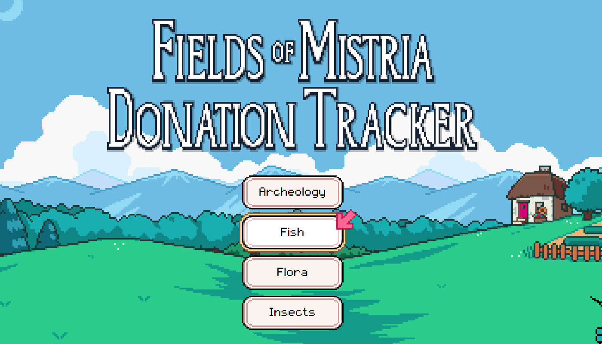
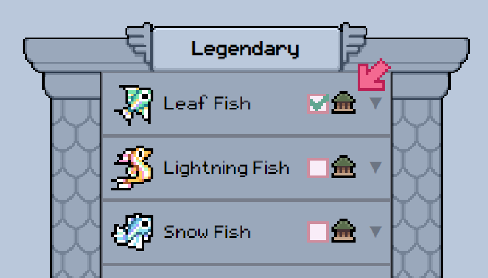
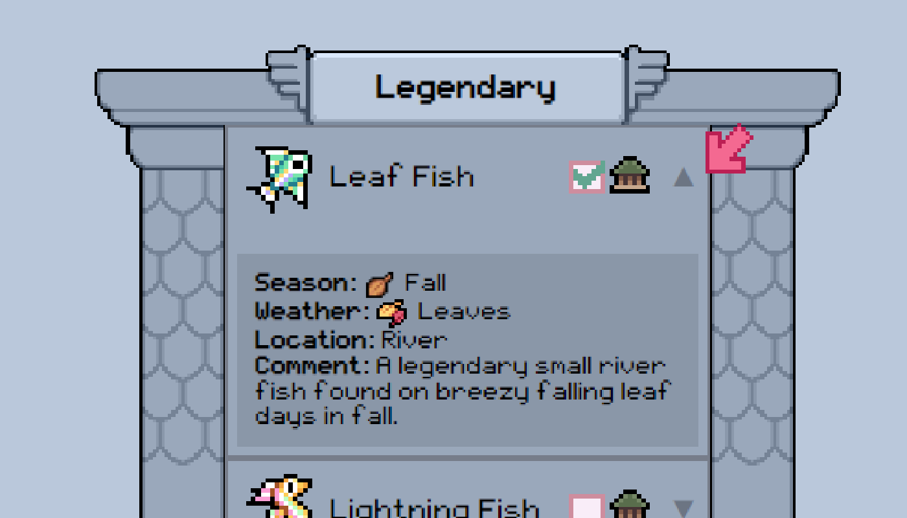

# Fields of Mistria Tracker

## Description
The Fields of Mistria Tracker is a simple and user-friendly tool designed to help players track their progress in donating crops, animals, and fish in the game *Fields of Mistria*. With an intuitive interface and organized layout, this tracker ensures you never miss a donation!

## Key Features
- **Donation Tracking**: Keep tabs on your donations with interactive checkboxes.
- **Dropdown Details**: View additional information about each item through dropdown menus.
- **Consistent Layout**: Each donation set is visually organized with five items per set, displayed in a container with an overlay image for clarity.
- **Technology Stack**: Built using Java, HTML, and CSS for a seamless user experience.

## How to Use
1. **Access the Tracker**:
   - [[Website Link](https://fields-of-mistria-tracker.vercel.app/)] 

2. **Navigate the Interface**:
   - View donation sets categorized by crops, animals, and fish.
   
   - Use the checkboxes to mark items as donated.
    
   - Expand dropdown menus for additional information on each item.
    
   - Search by item name or donation set
    

## Contributing
If you want to help improve the *Fields of Mistria* Tracke, here’s how you can get involved:
- **Report Issues**: Use the GitHub Issues tab to report bugs or suggest features.
- **Submit Pull Requests**: Fork the repository, make your changes, and submit a pull request for review.

## License
All assests are owned owned by NPC Studio and/or its licensors. All trademarks and registered trademarks present in the file are proprietary to NPC Studio and/or its licensors. The creator of this tool claims no ownership of the assets, trademarks, or any other proprietary materials related to *Fields of Mistria*.